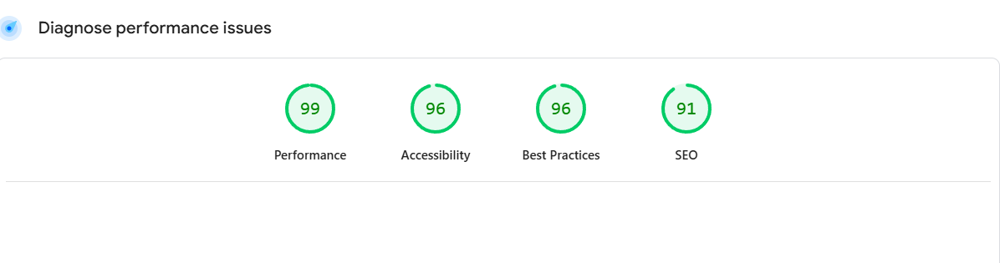

# 🛒 Fresh Cart Ecommerce

Fresh Cart is a modern e-commerce web application designed to simplify browsing, purchasing, and managing products. Built with React and the latest frontend technologies, it offers a smooth and interactive shopping experience for users. Features include product filtering, cart and favorites, secure authentication, and flexible payment methods.

---
## 📸 Screenshots


```markdown



---
## 🚀 Live Demo

🔗 [Visit Live App](https://fresh-cart-five-murex.vercel.app/)

---

## ✨ Features

### 👤 User Authentication & Authorization
- Secure login and registration system
- "Forgot Password" feature for recovery

### 🛍️ Product Management
- Browse a wide range of products
- Filter by categories or brands
- View product details (images, descriptions, prices)
- Add to cart or mark as favorite

### 💳 Payment Methods
- Secure online payment
- Cash on delivery option

### 📦 Order Management
- View order history
- Track current orders

### 👤 User Account
- Personal user page with profile info
- View saved favorites, orders, and preferences

### 🏷️ Categories & Brands
- Filter and explore products by brand or category

---

## 🧑‍💻 Skills & Technologies Used

### 🧱 Frontend Development
- **React.js** – Functional components, hooks, reusable architecture
- **Context API** – Global state management

### 🔀 Routing
- **React Router DOM** – Client-side routing with route protection

### 📑 Form Handling
- **Formik & Yup** – Robust form handling and validation

### 🌐 API Integration
- **Axios** – HTTP requests and error handling

### 🔐 Authentication
- **JWT-Decode** – Decode JSON Web Tokens

### 🧠 Meta Tags & SEO
- **React Helmet** – Meta tag management for SEO

### 🔔 Notifications
- **React Toastify** – Clean and interactive toast notifications

### ⏳ UX Enhancements
- **React Loader Spinner** – Loading indicators
- **React Detect Offline** – Offline mode detection
- **React Query** – Smart data fetching, caching, and updates

### 💅 Styling
- **Taiwind 5** – Responsive and consistent UI design

### 🚀 Deployment
- **Vercel** – Fast and scalable app deployment

---


